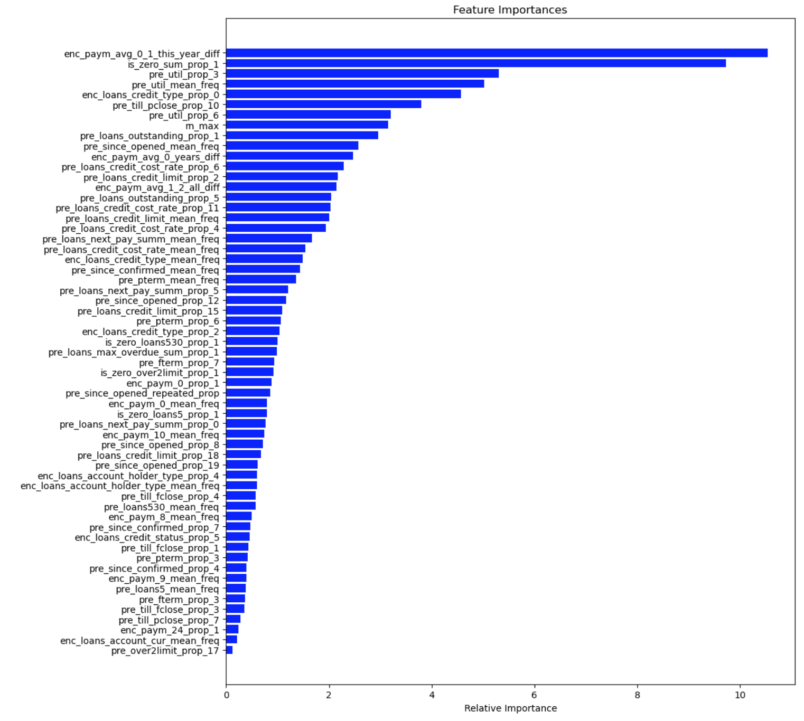
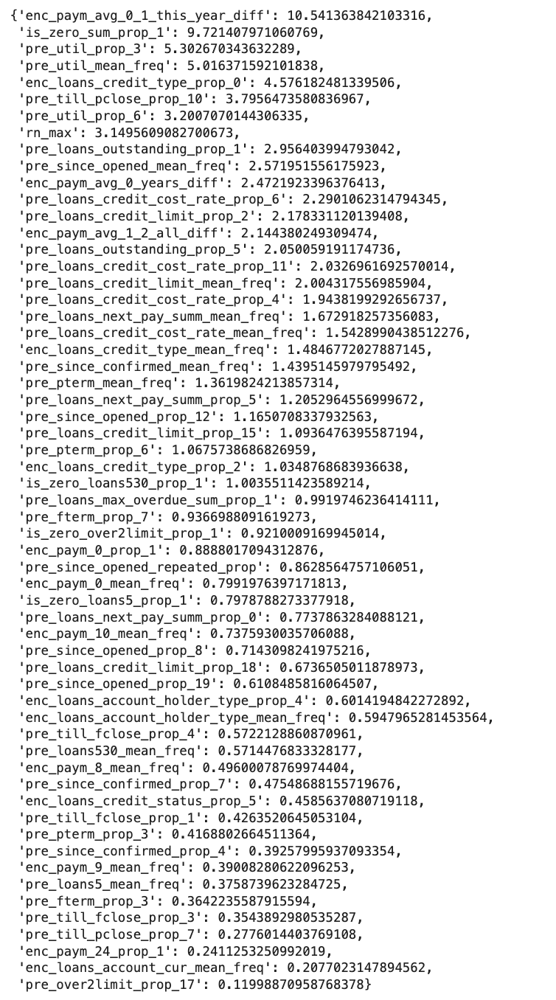
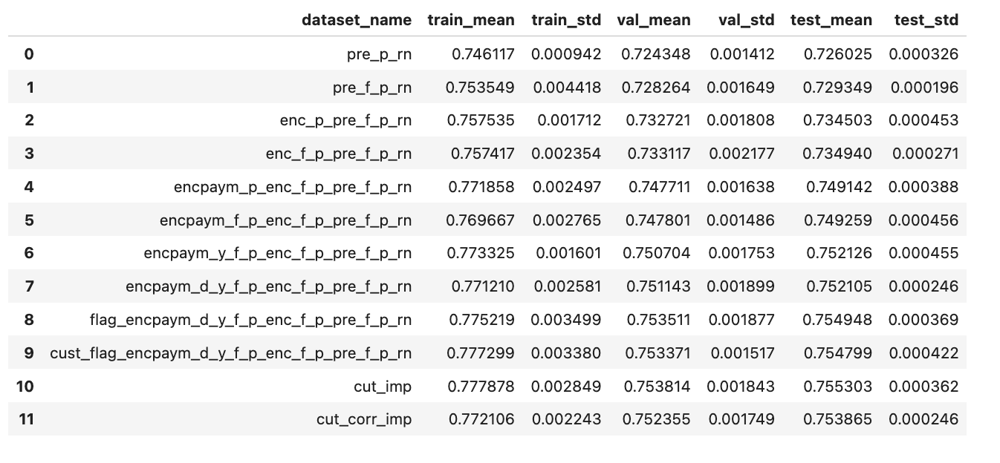
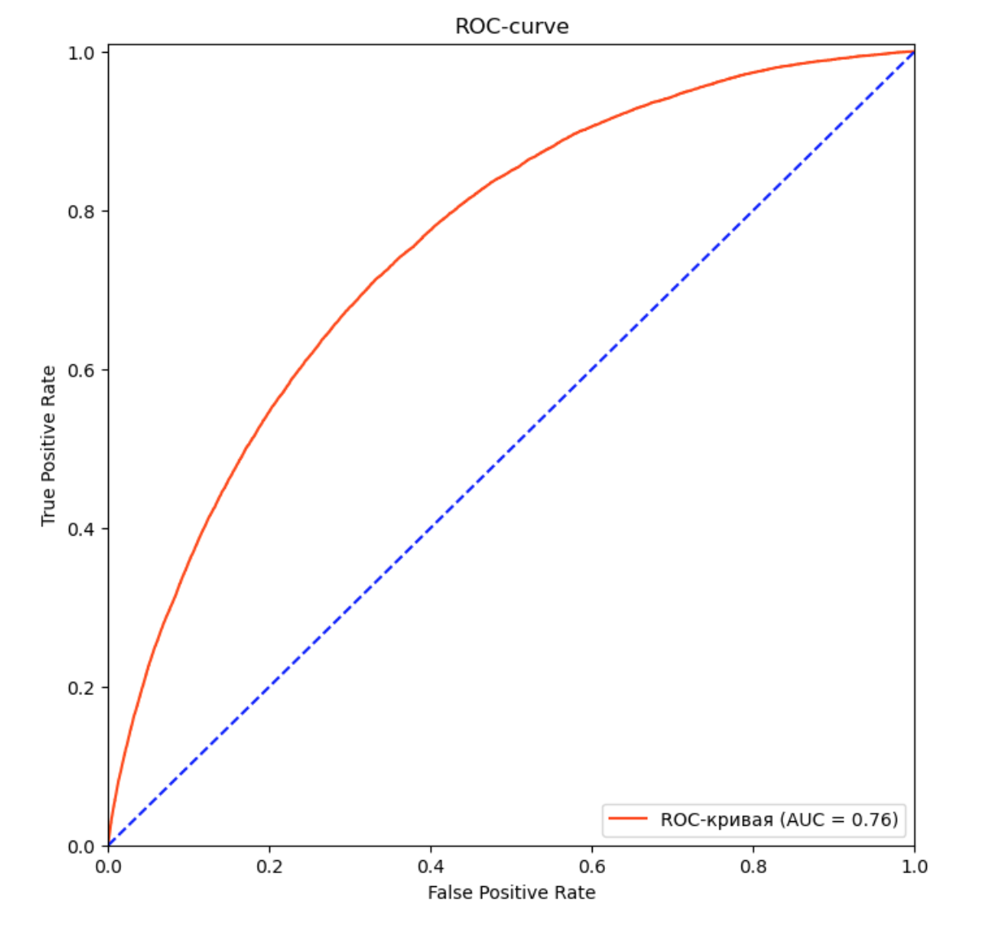

# Credit Scoring with CatBoost Ensemble
*Кредитный скоринг с ансамблем CatBoost*

---

## Содержание / Table of Contents

- [English Summary](#english-summary)
- [Краткое описание проекта](#краткое-описание-проекта)
- [Требования / Requirements](#требования--requirements)
- [Установка и запуск / Getting Started](#установка-и-запуск--getting-started)
- [Структура проекта / Project Structure](#структура-проекта--project-structure)
- [Особенности реализации / Implementation Details](#особенности-реализации--implementation-details)
  - [Обработка выбросов / Outlier Handling](#обработка-выбросов--outlier-handling)
  - [Общая схема построения и оценки признаков / General Scheme of Feature Engineering and Evaluation](#общая-схема-построения-и-оценки-признаков--general-scheme-of-feature-engineering-and-evaluation)
  - [Построение и оценка моделей / Model Building and Evaluation](#построение-и-оценка-моделей--model-building-and-evaluation)
- [Результаты / Results](#результаты--results)
- [Описание пайплайна / Pipeline Description](#описание-пайплайна--pipeline-description)
  - [Предобработка данных / Data Preprocessing](#предобработка-данных--data-preprocessing)
  - [Кастомный классификатор / Custom Classifier](#кастомный-классификатор--custom-classifier)
- [Примеры использования / Usage Examples](#примеры-использования--usage-examples)
  - [Извлечение частотных свойств значений категориальных признаков / Extraction of Frequency Based Features](#извлечение-частотных-свойств-значений-категориальных-признаков--extraction-of-frequency-based-features)
  - [Признак средней частотности значений / Feature of Mean Frequency of values](#признак-средней-частотности-значений--feature-of-mean-frequency-of-values)
  - [Оценка качества промежуточного датасета / Intermediate Dataset Quality Evaluation](#оценка-качества-промежуточного-датасета--intermediate-dataset-quality-evaluation)
  - [Автоматизированный подбор гиперпараметров / Automated Hyperparameter Tuning](#автоматизированный-подбор-гиперпараметров--automated-hyperparameter-tuning)
  - [Эффективная импутация пропусков в больших датасетах / Efficient Imputation of Missing Values in Large Datasets](#эффективная-импутация-пропусков-в-больших-датасетах--efficient-imputation-of-missing-values-in-large-datasets)
- [Автор / Author](#автор--author)


---

## English Summary
This project implements a credit scoring system to predict client default risk using an ensemble of six CatBoost classifiers.  
Five models are trained on separate subsets of the training data, each with hyperparameters individually optimized using Optuna.  
The sixth model is trained on the full training data, with hyperparameters selected from the fold that achieved the highest validation AUC score.

 Final predictions are weighted averages of the predicted class probabilities (predict_proba) based on the validation AUC scores of the models,  
 with the sixth model’s weight computed as the average AUC across its folds. 
 
 To obtain the final binary prediction (0 or 1), a threshold is selected in one of two ways:  
 by maximizing the difference between true positive rate (TPR) and false positive rate (FPR),  
 corresponding to the optimal point on the ROC curve, or by setting a minimum required TPR,  
 allowing the model to be adapted to specific business requirements.

 This educational project completes the Junior ML Engineer course and serves as a portfolio showcase.

---

## Краткое описание проекта

Данный проект реализует систему кредитного скоринга для предсказания риска дефолта клиентов с помощью ансамбля из шести моделей CatBoost.  
Пять моделей обучены на отдельных непересекающихся частях тренировочных данных, каждая с индивидуально подобранными гиперпараметрами с использованием Optuna.   Шестая модель обучена на полном тренировочном наборе, при этом её гиперпараметры — это параметры фолда с наивысшим значением метрики AUC на валидации.

Итоговые предсказания вероятностей классов (predict_proba) формируются как взвешенное среднее, где веса моделей пропорциональны их AUC на валидационных данных,  
а вес шестой модели вычисляется как среднее значение AUC по её фолдам.

Для получения итогового бинарного предсказания (0 или 1) используется порог, который подбирается двумя способами:  
по максимальной разнице между полнотой (TPR) и долей ложноположительных результатов (FPR), соответствующей оптимальной точке ROC-кривой,  
либо исходя из заданного минимального значения полноты (TPR), что позволяет адаптировать модель под бизнес-требования.

Проект является учебным, завершает курс Junior ML Engineer и служит основой портфолио.

---

## Требования / Requirements

- В проэкте использовалась версия Python 3.12.  
- Рекомендуется использовать Python 3.12 или выше,  
  так как эта версия содержит важные улучшения производительности и удобства,  
  а также уже получила широкую поддержку основных библиотек.
- Для установки зависимостей используйте файл `requirements.txt`:
```shell
pip install -r requirements.txt
```

- Для работы с исходными файлами датасета в папке `train_data`  
  и Jupiter ноутбуками из-за превышения размера в 50 MB  
  используется [Git Large File Storage (Git LFS)](https://git-lfs.github.com/).  
  Перед клонированием репозитория убедитесь, что Git LFS установлен и инициализирован:
```shell
git lfs install
```
---

## Установка и запуск / Getting Started

1. Клонируйте репозиторий:  

Вы можете клонировать репозиторий с помощью SSH:

```shell
git clone git@github.com:Sergey-Chursin/catboost-credit-scoring-pipeline.git
```
Или с помощью HTTPS:
```shell
git clone https://github.com/Sergey-Chursin/catboost-credit-scoring-pipeline.git
```

2. Создайте и активируйте виртуальное окружение: 
```shell
python -m venv venv
source venv/bin/activate # Linux/Mac
venv\Scripts\activate # Windows
``` 

3. Установите зависимости:  
```shell
pip install -r requirements.txt
```
4. Запустите Jupyter Notebooks из папки `notebooks` и выполняйте ячейки по порядку.

---

## Структура проекта / Project Structure

- `description.xlsx` – файл с описанием признаков исходного датасета.
- `images/` - папка с PNG файлами для вставки в README.md.
- `notebooks/` — папка с Jupyter ноутбуками:
  - `data_preparation_and_modeling.ipynb` - анализ данных, создание признаков,  
    оптимизация гиперпараметров моделей ансамбля, визуализации.  
  - `pipeline.ipynb` - пайплайн обработки данных и обучения моделей ансамбля.
- `pipeline/` - папка с результатами моделирования:
  - `trained_pipeline.pkl`- файл с обученным пайплайном,  
  - `test_predict.pkl` - файл с предсказынными классами на тестовых данных,  
  - `test_predict_proba.pkl` - файл с предсказанными вероятностями классов на тестовых данных.
- `README.md` - файл с описанием проекта, инструкциями по установке и использованию.
- `requirements.txt` — список зависимостей.
- `train_data` - папка с исходными файлами датасета в формате Parquet (`.pq`).
- `train_target.csv` - файл с целевой переменной.
- `Методические указания к итоговому проекту «Модель кредитного риск-менеджмента».pdf` -  
  файл с описанием задания к проекту, требованиями и рекомендациями по выполнению.

---

## Особенности реализации / Implementation Details

В проекте реализован полный цикл построения модели для предсказания дефолта клиента:
от сборки исходного датасета из разрозненных Parquet-файлов, генерации признаков,  
последующим отбором наиболее информативных признаков  
и оптимизацией гиперпараметров моделей ансамбля,  
до создания пайплайна, который автоматизирует обработку данных и обучение ансамбля моделей.

Размер исходного датасета составлял 26 162 717 строк и 61 столбец.  
Количество уникальных клиентов (ID) — 3 000 000.  
Датасет с целевой переменной (информация о дефолте клиента) содержит 3 000 000  
записей — по одному значению на каждого уникального клиента.

Таким образом, исходные данные представлены на уровне кредитных договоров,  
в то время как целевая переменная задана на уровне клиентов.  
Это потребовало выполнения агрегирования признаков по каждому клиенту и последующего объединения с целевой переменной.

Коэффициент дисбаланса целевой переменной составлял примерно 27.  
Для компенсации дисбаланса в моделях применялся параметр auto_class_weights='Balanced'.  
Другие методы балансировки, такие как оверсемплинг и андерсемплинг, не использовались по следующим причинам:  
оверсемплинг приводил к значительному увеличению объёма обучающего датасета, что усложняло и замедляло обучение,  
а андерсемплинг существенно сокращал количество данных, что приводило к ухудшению качества моделей.  

Датасет с целевой переменной был изначально разделён на обучающую и тестовую выборки в соотношении 80/20 с применением стратификации.  
На основе этого разделения исходный датасет также был разбит, и тренировочные и тестовые подвыборки обрабатывались отдельно.  

Основной сложностью проекта стало то, что исходные данные были представлены преимущественно в бинаризованном и закодированном виде.

- Бинаризация — область значений признака разбивается на N непересекающихся интервалов,  
  каждому из которых случайным образом присваивается уникальный номер от 0 до N-1.  
  Значения признака заменяются номерами соответствующих интервалов.
 
- Кодирование — каждому уникальному значению признака случайным образом  
  присваивается уникальный номер от 0 до K, и значения признака заменяются этими номерами.

Бинаризация существенно искажает количественную информацию, после неё нельзя утверждать что большее значение  
бинаризованного признака соответствует большему (или меньшему) исходному значению.  
Признаки превращаются в индикаторы принадлежности к определённому интервалу, теряя количественный смысл.

Кодирование сохраняет больше информации, но также не гарантирует упорядоченности значений:  
номера не отражают количественные отношения между исходными значениями.

В связи с этим для построения признаков тренировочного датасета основной упор был сделан на частотные свойства значений признаков.

Одним из основных методов построения признаков было создание для каждого уникального значения исходного признака числового признака, 
отражающего частоту встречаемости этого значения у клиента. Поскольку количество записей (кредитов) на каждого клиента различалось, 
полученные признаки нормировались на общее число записей данного клиента для нивелирования этой разницы.  
Для каждого исходного признака формировался отдельный мини-датасет с такими признаками,  
на котором обучался классификатор CatBoost с 5-кратной стратифицированной кросс-валидацией.  
По итогам обучения из каждого мини-датасета отбирались 2–3 наиболее информативных признака,  
которые включались в итоговый тренировочный датасет.

Вторым основным методом построения признаков является создание агрегированного признака,  
отражающего среднюю относительную частоту значений заданного столбца для каждого клиента (id).  
Для этого вычисляется частота встречаемости каждого уникального значения в исходном датасете,  
затем для каждого клиента эти частоты суммируются  и нормируются на количество записей клиента.

Самым важным для модели признаком стал агрегированный для каждого клиента показатель — разница между  
средним количеством статусов платежей 0 и 1 за последние 12 месяцев (enc_paym_avg_0_1_this_year_diff).  
Этот признак вычисляется как разница средней частоты «статуса 0» и «статуса 1» на один кредит за год  
и позволяет модели улавливать динамику и соотношение между разными типами платежных статусов,  
отражая изменения в поведении клиента за последнее время.




### Обработка выбросов / Outlier Handling

В данном проекте явная фильтрация выбросов не проводилась,  
так как исходные данные были представлены в бинаризованном и закодированном виде,  
а признаки формировались на основе агрегатов. Это снижает влияние выбросов на итоговые признаки и соответствует характеру данных.  
Такой подход позволяет сохранить важную информацию и избежать потенциальных искажений при удалении редких, но значимых значений.

### Общая схема построения и оценки признаков / General Scheme of Feature Engineering and Evaluation

Исходные признаки обрабатывались группами по типам: бинаризированные, закодированные, статусы ежемесячных платежей, флаги.  
Несколько признаков создавались  обособленно.  
После создания каждой новой группы признаков проводилась оценка их влияния на качество модели с помощью функции check_cat_boost.

Эта функция реализует 5-кратную стратифицированную кросс-валидацию модели CatBoost, вычисляет метрику ROC AUC на тренировочном,  
валидационном и тестовом наборах,  а также аккумулирует важности признаков. Результаты оценки сохранялись в датафрейм для удобного сравнения. 

Важности признаков вычислялись для визуальной оценки распределения их вклада в модель и для определения количества признаков  
с очень низким или нулевым влиянием на качество. При этом признаки с низкой важностью не удалялись автоматически.




После генерации всех признаков проводился их отбор: сначала удалялись признаки с вкладом в качество модели менее 1%,  
затем из мультиколлинеарных групп (корреляция выше 0.7 по модулю) оставлялись только те признаки,  
которые давали наибольший прирост качества.

Такой подход позволил сформировать компактный и информативный набор признаков, обеспечивающий требуемое качество кредитного скоринга.

Изначально было создано 216 признаков.  
После отбора по вкладу в качество осталось 136 признаков.  
После отбора по мультиколлинеарности осталось 59 признаков.

### Построение и оценка моделей / Model Building and Evaluation

В проекте реализованы две схемы построения ансамблей моделей с использованием CatBoost  
и автоматическим подбором гиперпараметров через Optuna (используется TPE-сэмплер и pruning):

1. Агрессивная схема
- Для каждого из 5 фолдов выполняется автоматический подбор гиперпараметров. 
- Финальная модель обучается на объединённых тренировочных и валидационных данных с оптимальными параметрами.  
- Для тестовой выборки формируется средневзвешенное предсказание ансамбля.  
  Весами для моделей служат их AUC на валидационных выборках.

Такая схема максимально использует данные для обучения и часто применяется на соревнованиях,  
но может приводить к переобучению и снижению стабильности при применении модели на новых данных.

2. Классическая (консервативная) схема. 
- Для каждого фолда подбираются гиперпараметры и обучается модель только на тренировочной части фолда.  
- Оценивается AUC на валидационной выборке.  
- По результатам оценки фолдов выбираются гиперпараметры самого результативного и на них обучается финальная модель на всех тренировочных данных.  
- Для тестовой выборки формируется средневзвешенное предсказание ансамбля, включающего модели фолдов и финальную модель.  
  Весами для моделей фолдов служат их AUC на валидационных выборках, а вес финальной модели равен среднему арифметическому AUC всех фолдов.

Эта схема более надёжна и лучше отражает реальный алгоритм применения модели.

Итоги:  
Обе схемы показали практически одинаковое качество на тесте (AUC ~0.7572).  
В пайплайне выбран классический подход как более стабильный и интерпретируемый метод.  
Использование Optuna с TPE и pruning позволило эффективно подобрать гиперпараметры, ускоряя обучение и снижая риск переобучения.  
Результаты оптимизации сохраняются в базе SQLite для возможности возобновления обучения при прерывании.

---

## Результаты / Results

Задача заключалась в достижении на тестовой выборке значения метрики ROC-AUC не ниже 0,75.  
Полученный результат — около 0,7572 подтверждает успешное выполнение поставленной цели   
и свидетельствует о приемлемом качестве классификации.


---

## Описание пайплайна / Pipeline Description

В проекте реализован отдельный пайплайн для автоматизированной обработки данных и обучения ансамбля моделей.  
В отличие от функций в исследовательской части проекта, в которые подаются исходный и целевой датасеты,  
функции пайплайна работают только с исходным датасетом, что соответствует принципам построения воспроизводимых и промышленных решений.

### Предобработка данных / Data Preprocessing
Несмотря на то, что исходные данные были предоставлены уже в подготовленном виде — без пропусков,  
дубликатов и с корректными целочисленными значениями, в основной пайплайн встроен этап предобработки  
для приближения к стандартам обработки и подготовки данных.

Особое внимание уделено обработке пропусков:
из-за большого размера датасета вычисление медиан по всем признакам может приводить к чрезмерному потреблению памяти  
и падению ядра Jupyter ноутбука. Для решения этой задачи реализован кастомный импутер,  
который рассчитывает медианы по случайной подвыборке - 10% от общего объёма данных (доля может варьироваться).  
Такой подход обеспечивает близость оценок к реальным медианам при существенной экономии ресурсов — например,  
для признака id погрешность между реальной и оценочной медианой составила всего около 0.05%.  
Это компромисс между точностью и производительностью, позволяющий применять пайплайн на больших объёмах данных.  

Выбор медианы в качестве статистики для заполнения пропусков обусловлен скошенной формой распределения многих признаков.

### Кастомный классификатор / Custom Classifier
В проекте реализован собственный классификатор, совместимый с интерфейсом scikit-learn (наследует BaseEstimator и ClassifierMixin).  
Классификатор инкапсулирует ансамбль моделей CatBoost повторяя классическую схему из исследовательской части,  
поддерживает взвешенное усреднение предсказаний по AUC и реализует основные методы для интеграции  
в пайплайны scikit-learn — fit, predict, predict_proba, а также transform и fit-transform для совместимости с пайплайном.

Гиперпараметры моделей передаются в классификатор заранее,  
их автоматизированный подбор реализован в исследовательской части с помощью Optuna.  
Такой подход позволяет гибко экспериментировать с параметрами, повторять эксперименты и обеспечивает воспроизводимость результатов. 

---

## Примеры использования / Usage Examples

Несмотря на то, что целиком пайплайн рассчитан на работу с конкретным датасетом,  
в исследовательской части и в пайплайне реализованы функции,  
обладающие универсальным характером и способные быть использованы в других проектах. 

Примеры

### Извлечение частотных свойств значений категориальных признаков / Extraction of Frequency Based Features
Для обработки категориальных признаков (в том числе бинаризированных и закодированных,  
которые также можно рассматривать как категориальные) и извлечения частотных свойств их значений  
удобно последовательно использовать следующие функции:
- create_all_value_proportion_features — создаёт новые признаки для всех уникальных значений исходного признака,  
  отражающие долю записей для id в которых это значение встречается. Требуется id и признак количества записей для id.  
- choose_n_most_imp_features — отбирает заданное количество наиболее важных для модели CatBoost частотных признаков.  
- create_definite_value_proportion_features — на основе словаря формирует частотные признаки только для  
  выбранных значений исходного признака.

Пример использования в исследовательской части проекта
```python
"""
Создадим словарь, где ключами будут имена исходных признаков из pre_features,
а значениями — три уникальных значения признака, на основе которых
будут созданы новые частотные признаки с наибольшим вкладом в качество модели.
"""
pre_prop_features_dictionary = {}

for col in pre_features_cut:
    print('-' * 50)
    print('Исходный признак:', col)
    
    # Создаём новые частотные признаки для каждого уникального значения признака col
    df_train, new_features_list = create_all_value_proportion_features(
        source_df_train,
        df_train,
        col
    )
    print('Новые признаки тренировочного датасета:\n' +
          '\n'.join(new_features_list))
    
    # Определяем 3 наиболее важных значения признака с помощью CatBoost
    values = choose_n_most_imp_features(df_train, new_features_list, 3)
    print('Наиболее важные категории признака:', values)
    
    # Сохраняем их в словарь
    pre_prop_features_dictionary[col] = values

    # Удаляем все новые признаки из тренировочного датафрейма
    df_train = df_train.drop(new_features_list, axis=1)

# Создадим признаки из выбранных значений в тренировочном датасете
df_train = create_definite_value_proportion_features(
    source_df_train,
    df_train,
    pre_prop_features_dictionary
)
```
Такой подход позволяет автоматически выявлять наиболее информативные категории и строить компактные,  
но содержательные частотные признаки для последующего использования в моделях,  
это особенно полезно при большом количестве уникальных значений.

### Признак средней частотности значений / Feature of Mean Frequency of values
Функция create_mean_values_frequency_feature добавляет в датафрейм признак,  
отражающий среднюю относительную частоту значений заданного столбца для каждого клиента (id).  
Это удобно для обработки категориальных, бинаризированных и закодированных признаков.

```python
# Например, хотим добавить признак средней частоты значений столбца 'feature_col'
df_to_update = create_mean_values_frequency_feature(
    df_source=df_source,
    df_to_update=df_to_update,
    column='feature_col'
)

# Теперь в df_to_update появился новый столбец 'feature_col_mean_freq'
print(df_to_update[['id', 'feature_col_mean_freq']].head())
```
Пояснения:
df_source — датафрейм с исходными записями (например, по кредитам).  
df_to_update — датафрейм, в который добавляется новый агрегированный признак по каждому клиенту.  
column — имя исходного признака, для которого вычисляется средняя частота.  
Требуется колонка id и колонка с количеством записей для id (например, rn_max).

Такой признак отражает, насколько значения данного признака у клиента являются редкими  
или, наоборот, типичными по сравнению с остальными клиентами.  
Если у клиента чаще встречаются редкие значения, агрегированный признак будет ниже, если типичные — выше.  
Это позволяет модели выявлять клиентов с необычными паттернами поведения, что важно для задач скоринга,  
обнаружения аномалий и построения интерпретируемых моделей.

### Оценка качества промежуточного датасета / Intermediate Dataset Quality Evaluation
Для оценки качества промежуточных датасетов и отбора информативных признаков в проекте  
используется вспомогательная функция check_cat_boost.  
Она реализует 5-кратную стратифицированную кросс-валидацию CatBoost, вычисляет метрику ROC AUC на обучающем,  
валидационном и тестовом наборах, а также накапливает важности признаков по фолдам.  
Результаты сохраняются в датафрейм для удобного сравнения между различными наборами признаков,  
а медианные важности признаков возвращаются в виде отсортированного словаря.

Примечание: число фолдов и random seed заданы по умолчанию и могут быть вынесены в параметры функции при необходимости.

Этот инструмент автоматизирует типовой процесс оценки промежуточных датасетов,  
что позволяет быстро сравнивать вклад различных групп признаков в итоговое качество скоринговой системы.

### Автоматизированный подбор гиперпараметров / Automated Hyperparameter Tuning
В проекте реализованы две функции для автоматизированного подбора гиперпараметров CatBoost с использованием библиотеки Optuna,  
они реализуют схожий функционал и отличаются только тем, на каких данных обучается финальная модель:  
- catboost_optuna_aggressive — обучает финальную модель на объединённых тренировочных и валидационных данных.  
- catboost_optuna_conservative — обучает финальную модель только на тренировочной части.

Обе функции используют продвинутые возможности Optuna:
- TPE-сэмплер — — это вероятностный метод оптимизации гиперпараметров, основанный на построении моделей  
  распределения лучших и худших значений целевой функции, это адаптивный вероятностный метод,  
  обучающийся на результатах предыдущих испытаний;  
- Pruning — досрочное завершение неэффективных испытаний для ускорения оптимизации;  
- Сохранение истории поиска ГП в SQLite — это позволяет не только возобновлять оптимизацию после прерываний,  
  но и использовать накопленную информацию для более эффективного продолжения поиска гиперпараметров при повторных запусках.

Параметры процесса оптимизации можно гибко задавать через аргументы функций:  
- seed — зерно рандома для воспроизводимости (по умолчанию 0);  
- iterations — максимальное число деревьев для каждой модели CatBoost (по умолчанию 3000);  
- n_trials — количество испытаний Optuna для подбора гиперпараметров (по умолчанию 100);  
- n_startup_trials — количество первых trials без pruning (по умолчанию 10);  
- n_warmup_steps — количество первых итераций модели без pruning (по умолчанию 50);  
- cat_features — список имён категориальных признаков (по умолчанию None);  
- study_name — имя Optuna study для сохранения результатов в базе данных.

Пространство гиперпараметров для поиска зафиксировано внутри функций и не регулируется через аргументы.

В проекте эти функции применяются последовательно на разных фолдах тренировочного датасета для построения ансамбля моделей,
однако их также можно использовать и для обучения на всём датасете целиком.

Пример использования и подробная последовательность шагов приведены в ноутбуке data_preparation_and_modeling.ipynb.  
Для воспроизведения экспериментов и изучения деталей рекомендуется обращаться к ноутбуку. 

### Эффективная импутация пропусков в больших датасетах / Efficient Imputation of Missing Values in Large Datasets
В проекте для эффективной обработки пропусков в больших датасетах используется кастомный импьютер SampleMedianImputer,  
который является частью общего пайплайна предобработки данных.

Из-за большого объёма данных вычисление медиан по всему датасету требует значительных ресурсов памяти и может  
приводить к падению ядра ноутбука. Для решения этой проблемы SampleMedianImputer вычисляет медианы  
на случайной подвыборке данных (по умолчанию 10%), что значительно снижает нагрузку на память и ускоряет процесс. 

При этом оценки медиан являются приближенными, но достаточно точными для практического использования — например,  
для признака id погрешность оценки составила около 0.05%.  
Такой подход представляет собой компромисс между точностью и производительностью и позволяет  
охранять стабильность работы пайплайна при обработке больших данных.

Данное решение может быть полезно при работе с большими наборами данных, где стандартные методы вычисления медиан  
оказываются слишком ресурсоёмкими. Использование подвыборки для оценки медиан — простой и эффективный способ  
ускорить импутацию пропусков без значительной потери качества.

Класс SampleMedianImputer интегрируется в общий sklearn-пайплайн, обеспечивая автоматическую и воспроизводимую  
предобработку данных в рамках всего процесса моделирования.


## Автор / Author

Чурсин Сергей Сергеевич  
serchurs@gmail.com  
Телефон: +7 (901) 722-85-47
