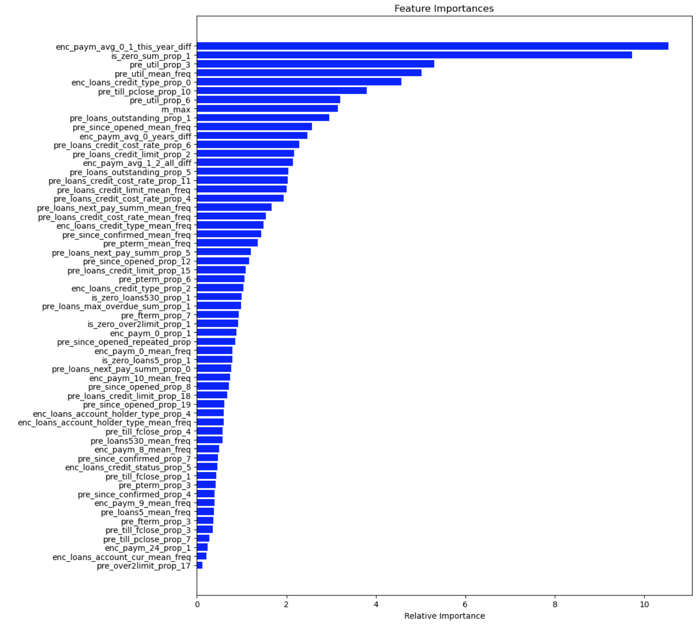
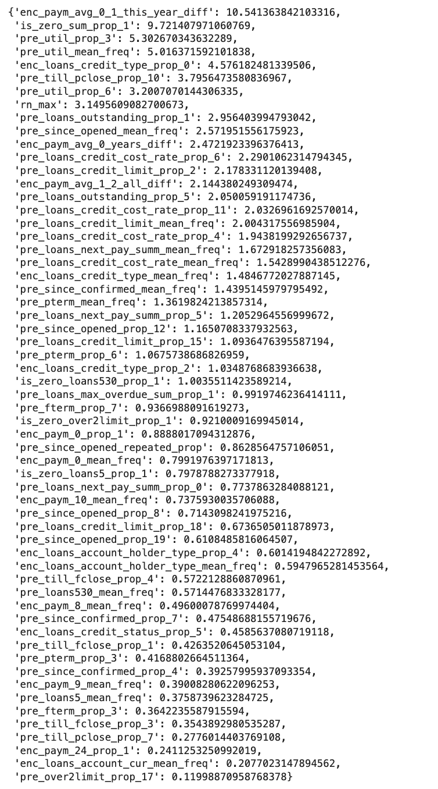
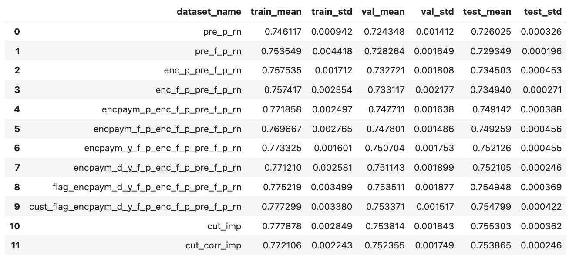
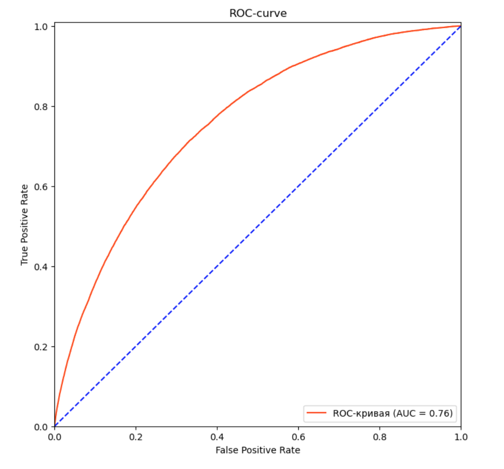

добавить pyproject.toml в структуру

# Credit Scoring with CatBoost Ensemble
*Кредитный скоринг с ансамблем CatBoost*

---

## Содержание / Table of Contents

- [English Summary](#english-summary)
- [Краткое описание проекта](#краткое-описание-проекта)
- [Требования / Requirements](#требования--requirements)
- [Установка и запуск / Getting Started](#установка-и-запуск--getting-started)
  - [Запуск в Conda окружении / Running in a Conda environment](#запуск-в-conda-окружении--running-in-a-conda-environment)
  - [Запуск в Docker-контейнере / Running in a Docker container](#запуск-в-docker-контейнере--running-in-a-docker-container)
  - [Запуск API сервиса / Running the API service](#запуск-api-сервиса--running-the-api-service)
- [Структура проекта / Project Structure](#структура-проекта--project-structure)
- [Особенности реализации / Implementation Details](#особенности-реализации--implementation-details)
  - [Исследовательская часть / Jupyter notebooks](#исследовательская-часть--jupyter-notebooks)
    - [Обработка выбросов / Outlier Handling](#обработка-выбросов--outlier-handling)
    - [Общая схема построения и оценки признаков / General Scheme of Feature Engineering and Evaluation](#общая-схема-построения-и-оценки-признаков--general-scheme-of-feature-engineering-and-evaluation)
    - [Построение и оценка моделей / Model Building and Evaluation](#построение-и-оценка-моделей--model-building-and-evaluation)
    - [Результаты / Results](#результаты--results)
  - [Описание пайплайна / Pipeline Description](#описание-пайплайна--pipeline-description)
    - [Предобработка данных / Data Preprocessing](#предобработка-данных--data-preprocessing)
    - [Построение признаков / Feature engineering](#построение-и-оценка-моделей--model-building-and-evaluation)
    - [Кастомный классификатор / Custom Classifier](#кастомный-классификатор--custom-classifier)
    - [Конфигурация и управление / Configuration and management](#конфигурация-и-управление--configuration-and-management)
    - [Оптимизация потребления памяти в Docker-контейнере при лимите 16 Гб RAM](#оптимизация-потребления-памяти-в-docker-контейнере-при-лимите-16-гб-ram)
  - [Особенности реализации API / API Implementation Details](#особенности-реализации-api--api-implementation-details)
- [Примеры использования / Usage Examples](#примеры-использования--usage-examples)
  - [Примеры из исследовательской части / Examples from the research section](#примеры-из-исследовательской-части--examples-from-the-research-section)
    - [Извлечение частотных свойств значений категориальных признаков / Extraction of Frequency Based Features](#извлечение-частотных-свойств-значений-категориальных-признаков--extraction-of-frequency-based-features)
    - [Признак средней частотности значений / Feature of Mean Frequency of values](#признак-средней-частотности-значений--feature-of-mean-frequency-of-values)
    - [Оценка качества промежуточного датасета / Intermediate Dataset Quality Evaluation](#оценка-качества-промежуточного-датасета--intermediate-dataset-quality-evaluation)
    - [Автоматизированный подбор гиперпараметров / Automated Hyperparameter Tuning](#автоматизированный-подбор-гиперпараметров--automated-hyperparameter-tuning)
  - [Примеры из pipeline / Examples from pipeline](#примеры-из-pipeline--examples-from-pipeline)
    - [Загрузка датасета из нескольких файлов / Flexible Multi-Format Data Batch Loader](#загрузка-датасета-из-нескольких-файлов--flexible-multi-format-data-batch-loader)
    - [Эффективная импутация пропусков в больших датасетах / Efficient Imputation of Missing Values in Large Datasets](#эффективная-импутация-пропусков-в-больших-датасетах--efficient-imputation-of-missing-values-in-large-datasets)
    - [Бинарный классификатор / Binary classifier](#бинарный-классификатор--binary-classifier)
    - [Оценка метрик / Evaluation of metrics](#оценка-метрик--evaluation-of-metrics)
    - [Мониторинг оперативной  памяти / RAM Monitoring](#мониторинг-оперативной--памяти--ram-monitoring)
    - [Управление оперативной памятью / Active RAM Management](#управление-оперативной-памятью--active-ram-management)
    - [Логирование / Logging](#логирование--logging)
  - [Использование API / API Using](#использование-api--api-using)
    - [Предикт для одного клиента с одним кредитом / Predict for a Single Client with a single credit](#предикт-для-одного-клиента-с-одним-кредитом--predict-for-a-single-client-with-a-single-credit)
    - [Обработка нескольких клиентов / Batch Scoring (multiple clients)](#обработка-нескольких-клиентов--batch-scoring-multiple-clients)
    - [Проверка готовности / Health Check](#проверка-готовности--health-check)
- [Инструкция  для CLI-запуска](#инструкция--для-cli-запуска)

- [Автор / Author](#автор--author)

---

## English Summary
This project implements a fully automated pipeline for solving the credit scoring task based on an ensemble of six CatBoost models, optimized for hyperparameters with Optuna.  
For practical application and automated batch scoring, an API service based on FastAPI is provided.

The project provides Docker Compose configurations for three main use cases: API service deployment, manual command-line script execution, and running a Jupyter Notebook server.

All stages of data preprocessing, training, inference, and model evaluation are encapsulated in a single modular pipeline, which is launched via an CLI interface with a flexible flag system and detailed documentation on usage scenarios.

Particular attention is paid to optimizing the algorithm's operation with a large dataset (over 26 million rows) in a Docker container with a 16 GB RAM limit. To achieve this, custom tools for memory monitoring and management are used, data is loaded and processed in batches, missing values are imputed with the median calculated on a subsample, and techniques like mask/transform are used for aggregation and feature construction instead of merge/agg, among other methods.

The code is organized according to the principles of modularity and separation of concerns: all parameters are centralized in a configuration file, and the main blocks are implemented as separate functions and classes, ensuring easy integration into new projects and convenient adaptation to various tasks.

The ensemble architecture follows classic Data Science competition practices: five models are trained on separate folds with individual parameter tuning, while the sixth is trained on the full training dataset using the best fold’s optimal parameters. Final probabilities are averaged using weights proportional to each model’s validation AUC, and for binary classification, an optimal threshold is chosen to maximize the difference between TPR and FPR or to meet a required TPR as dictated by business logic.

Although the project is educational and concludes the Junior ML Engineer course, it is developed with a focus on approximating a real production-grade, end-to-end ML pipeline—from data loading and preparation, through complex multi-level feature generation and advanced model optimization, to engineering infrastructure setup: REST API service, CLI interface with adjustable logging levels, Docker environment, memory management, and automated resource monitoring.
An automated testing system is also implemented, featuring pytest-based unit tests that cover the main stages of data processing, feature engineering, model training, and key utility functions.

---

## Краткое описание проекта

Данный проект реализует полностью автоматизированный end‑to‑end цикл для решения задачи кредитного скоринга на основе ансамбля из шести моделей CatBoost,  
оптимизированных по гиперпараметрам с помощью Optuna.  
Для практического применения и автоматизации batch‑скоринга реализован API‑сервис на базе FastAPI.

В проекте реализован запуск через Docker Compose с тремя конфигурациями: для сервиса API, ручного CLI-запуска скриптов и запуска Jupyter Notebook сервера.

Все этапы обработки данных, обучения, инференса и оценки модели инкапсулированы в единый модульный пайплайн, который запускается через CLI-интерфейс с гибкой системой флагов и подробной документацией по сценариям работы.

Особое внимание уделено оптимизации работы алгоритма с большим датасетом (26+ млн. строк) в Docker-контейнере при ограничением оперативной памяти в 16 Гб. Для этого применяются собственные инструменты мониторинга и управления памятью, загрузка и обработка данных батчами, импутация пропусков медианой расчитанной на подвыборке, приёмы вроде mask/transform для агрегирования и построения признаков вместо merge/agg и другие методы.

Код организован по принципам модульности и разделения ответственности: все параметры централизовано вынесены в конфигурационный файл, основные блоки построены в виде отдельных функций и классов, что обеспечивает простую интеграцию в новые проекты и лёгкость доработки под различные задачи.

Архитектура ансамбля моделей воспроизводит классические практики соревнований по Data Science: пять моделей тренируются на отдельных фолдах с индивидуальным подбором параметров, шестая — на всём тренировочном датасете с оптимальными параметрами лучшего фолда. Итоговые вероятности усредняются с использованием весов, пропорциональных AUC моделей на валидации, а для бинарной классификации используется оптимальный порог, рассчитанный по максимальной разнице TPR и FPR либо под требуемую полноту TPR по бизнес-логике.

Несмотря на то что проект является учебным и завершает курс Junior ML Engineer, он разработан с ориентацией на приблежение к реальному промышленному пайплайну полного цикла - от загрузки и подготовки данных, сложной и многоуровневой генерации признаков, продвинутой оптимизации моделей до настройки инженерной инфроструктуры: REST API сервис, CLI-интерфейс с  настройкой уровней логирования, Docker-окружение, управление памятью, автоматизированный мониторинг ресурсов.
Также реализована система автоматического тестирования, включающая юнит-тесты на базе pytest, которые покрывают главные этапы обработки данных, feature engineering, обучения моделей и ключевые служебные функции.

---

## Требования / Requirements

- В проэкте использовалась версия Python 3.12.  
- Рекомендуется использовать Python 3.12 или выше,  
  так как эта версия содержит важные улучшения производительности и удобства,  
  а также уже получила широкую поддержку основных библиотек.

---

## Установка и запуск / Getting Started

Проект поддерживает запуск как в Conda-окружении, так и внутри Docker-контейнера.  
Если объём оперативной памяти хоста составляет менее 24 ГБ, для работы с Jupyter notebooks предпочтительнее использовать Conda,
поскольку при работе внутри контейнера выполнение ноутбуков может завершаться с ошибкой из-за нехватки памяти (OOM).  
Скрипты проекта оптимизированы для Docker-контейнера с лимитом оперативной памяти 16 ГБ.  

Обратите внимание: ограничения по стабильности работы Jupyter notebooks при объёме оперативной  
памяти ниже 24 ГБ относятся только к запуску в контейнере.   
В Conda-окружении все Jupyter notebooks выполняются при ограничении оперативной памяти в 16 Гб.  

API сервис запускается во всех режимах: в Conda-окружении и в трёх конфигурациях Docker Compose.  
Проверка работоспособности сервиса через endpoint /health доступна во всех режимах, однако автоматический перезапуск сервиса осуществляется только в Docker-конфигурации api.


### Запуск в Conda окружении / Running in a Conda environment

1. Проект доступен через клон репозитория или скачивание архива с релизом проекта с  
   https://github.com/Sergey-Chursin/catboost-credit-scoring-pipeline/releases  

Вы можете клонировать репозиторий с помощью SSH:

```shell
git clone git@github.com:Sergey-Chursin/catboost-credit-scoring-pipeline.git  
```
Или с помощью HTTPS:  
```shell
git clone https://github.com/Sergey-Chursin/catboost-credit-scoring-pipeline.git  
```

2. Перейдите в корневую директорию проекта. 

```shell
cd catboost-credit-scoring-pipeline
```

3. Установите Miniconda или Anaconda (если не установлено). 

Скачать: https://docs.conda.io/en/latest/miniconda.html. 

4. Создайте и активируйте новое окружение. 

Можно задать любое имя окружения (замените project_ml_env на удобное вам).  

```shell
conda env create -f environment.yml -n project_ml_env
conda activate project_ml_env
``` 
5. Проверьте работу

Запустите тесты  
```shell
python -m pytest
``` 
или с более подробным выводом  
```shell
python -m pytest -s -v 
``` 
Либо запустите один из основных скриптов:  
Тестовый режим с получением предикта на тестовой выборке с выводом метрики ROC AUC.  
Репозиторий уже содержит обученный pipeline поэтому можно сразу запустить любой режим.  
```shell
python -m src.pipeline --log-level info --mode test --eval-metrics auc
``` 

Тренировочный режим
```shell
python -m src.pipeline --log-level info --mode train 
``` 

Инференс на новых данных (используются все обучающие данные)
```shell
python -m src.pipeline --log-level info --mode inference 
``` 

Инференс на новых данных (с выбором количества обрабатываемых партиций )
```shell
python -m src.pipeline --log-level info --mode inference --max-files 3
``` 

Подробное описание работы в различных режимах смотрите в комментариях в начале файла pipeline.py и в конце этого.  

6. Работа в Jupyter (опционально)  

Если установили Conda, то следующая команда запустит сервер jupyter в браузере по умолчанию:  
```shell
jupyter notebook
``` 
Если установили Miniconda, то предварительно нужно установить пакет пакет Jupyter:  
```shell
conda install jupyter
``` 

Далее в браузере, открывшемся интерфейсе Jupyter найдите директорию проекта, перейдите в папку notebooks,
выберите нужный ноутбук и откройте его.  
Вы можете запускать ячейки ноутбука или просто просматривать содержимое.  

7. Отключение или удаление окружения

Выйти из окружения:
```shell
conda deactivate
``` 
Полностью удалить окружение:
```shell
conda env remove -n project_ml_env
``` 

### Запуск в Docker-контейнере / Running in a Docker container

В проекте реализована гибкая система запуска через Docker Compose с поддержкой разных конфигураций контейнеров.  
Доступно три варианта запуска:  
api — самая лёгкая, предназначена для быстрого старта FAST API сервиса.  
light — контейнер для ручной работы в терминале, исполнения скриптов и запуска тестов.  
jupyter - тяжёлая конфигурация, для ручной работы в терминале и запуска Jupyter сервера для просмотра или запуска Jupyter notebooks.

Дальнейшие шаги запуска, общие для light и jupyter режимов (различия только в командах запуска контейнера).

1. Проект доступен через клон репозитория или скачивание архива с релизом проета с  
   https://github.com/Sergey-Chursin/catboost-credit-scoring-pipeline/releases:    

Вы можете клонировать репозиторий с помощью SSH:

```shell
git clone git@github.com:Sergey-Chursin/catboost-credit-scoring-pipeline.git 
```
Или с помощью HTTPS:  
```shell
git clone https://github.com/Sergey-Chursin/catboost-credit-scoring-pipeline.git 
``` 

2. Перейдите в корневую директорию проекта. 

```shell
cd catboost-credit-scoring-pipeline
```

3. Соберите Docker-образ и запустите контейнер в интерактивном режиме с доступом к терминалу для выполнения скриптов вручную
 
Перед запуском убедитесь, что Docker Desktop включён и работает.
Для запуска light версии:  
```shell
docker-compose run --service-ports -it --rm light bash
```

Для запуска jupyter версии:
```shell
docker-compose run --service-ports -it --rm jupyter bash
```

4. Проверьте работу

Запустите тесты  
```shell
python -m pytest
``` 
или с более подробным выводом  
```shell
python -m pytest -s -v 
``` 
Либо запустите один из основных скриптов:  
Тестовый режим с получением предикта на тестовой выборке с выводом метрики ROC AUC.  
Репозиторий уже содержит обученный pipeline поэтому можно сразу запустить любой режим.  
```shell
python -m src.pipeline --log-level info --mode test --eval-metrics auc
``` 

Тренировочный режим
```shell
python -m src.pipeline --log-level info --mode train 
``` 

Инференс на новых данных (используются все обучающие данные)
```shell
python -m src.pipeline --log-level info --mode inference 
``` 

Инференс на новых данных (с выбором количества обрабатываемых партиций )
```shell
python -m src.pipeline --log-level info --mode inference --max-files 3
``` 

Подробное описание работы в различных режимах смотрите в комментариях в начале файла pipeline.py и в конце этого.

5. Запуск Jupyter notebook сервера (только в конфигурации jupyter)

```shell
jupyter notebook --ip=0.0.0.0 --no-browser --allow-root
``` 
После запуска скопируйте из терминала токен доступа (строка вида 855f5c613a4f55d94c6a80644b0d3747cd58c3726a9866b1).  
Откройте браузер и перейдите по адресу: http://localhost:8888   
В форме “Password or token” вставьте скопированный токен и нажмите "Log in".  
В открывшемся интерфейсе найдите папку notebooks и запускайте нужный ноутбук.  

6. Закрытие контейнера с Jupyter notebook

После завершения работы в терминале нажмите "ctrl+c" и в течении 5 сек нажмите "y",  
если не успеете, то выключайте контейнер через Docker Desktop.  
Если успели то можно продожить работу в CLI-режиме.

7. Закройте контейнер (общий пункт для конфигураций jupyter и light)

Контейнер удалится автоматически если при запуске указан флаг --rm.
```shell
exit
``` 
8. Удалите образ в Docker Desktop

### Запуск API сервиса / Running the API service

Как указано выше, сервис API может быть запущен как в conda-окружении, так и во всех трех конфигурациях Docker Compose.  
Однако автоматическая проверка готовности сервера через эндпоинт /health с последующим перезапуском сервиса при необходимости реализована только в Docker Compose-конфигурации api.

1. В конфигурации api cборка образа, запуск контейнера и старт приложения производится одной командой

```shell
docker-compose up api
```

2. Для запуска API сервиса в других режимах выполните

```shell
python -m src.app
``` 

3. Проверить работу сервиса можно отправив несколько запросов на предикты через скрипт query.py(из отдельной вкладки терминала)

```shell
python -m src.query
``` 
Либо через через OpenAPI в браузере по относительным адресам:  
/docs (Swagger UI)  
/redoc (Redoc)  
Пример: http://localhost:8000/docs  
В Swagger UI можно не только ознакомиться с описанием сервиса, но и отправлять тестовые
запросы к любому endpoint. 

---

## Структура проекта / Project Structure
- `data/` — данные проекта:
  - `processed/` — обработанные данные
  - `raw/` — исходные данные в формате Parquet
  - `target/` — целевая переменная
  - `temp/` — временные файлы обработки
- `docker-compose.yml` - файл оркестрации и конфигурации запуска Docker-контейнеров
- `Dockerfile.jupyter` - спецификация сборки Docker-образа jupyter
- `Dockerfile.light` — спецификация сборки Docker-образа light
- `Dockerfile.prod` — спецификация сборки Docker-образа api
- `environment.yml` — описание conda-окружения и зависимостей
- `images/` — изображения для README и отчетов
- `models/` — обученные модели и пайплайны
- `notebooks/` — Jupyter-ноутбуки исследовательской части и оптимизации гиперпараметров  
- `predictions/` — результаты инференса и тестовых предиктов
- `pytest.ini` — конфигурация для pytest
- `README.md` — описание и инструкция по проекту
- `resources/` — вспомогательные материалы (описание задания и методички)
- `src/` — исходный код проекта
- `tests/` — модульные тесты и проверки

---

## Особенности реализации / Implementation Details

### Исследовательская часть / Jupyter notebooks

Размер исходного датасета составлял 26 162 717 строк и 61 столбец.  
Количество уникальных клиентов (ID) — 3 000 000.  
Датасет с целевой переменной (информация о дефолте клиента) содержит 3 000 000  
записей — по одному значению на каждого уникального клиента.

Таким образом, исходные данные представлены на уровне кредитных договоров,  
в то время как целевая переменная задана на уровне клиентов.  
Это потребовало выполнения агрегирования признаков по каждому клиенту и последующего объединения с целевой переменной.

Коэффициент дисбаланса целевой переменной составлял примерно 27.  
Для компенсации дисбаланса в моделях применялся параметр auto_class_weights='Balanced'.  
Другие методы балансировки, такие как оверсемплинг и андерсемплинг, не использовались по следующим причинам:  
оверсемплинг приводил к значительному увеличению объёма обучающего датасета, что усложняло и замедляло обучение,  
а андерсемплинг существенно сокращал количество данных, что приводило к ухудшению качества моделей.  

Датасет с целевой переменной был изначально разделён на обучающую и тестовую выборки в соотношении 80/20 с применением стратификации.  
На основе этого разделения исходный датасет также был разбит, и тренировочные и тестовые подвыборки обрабатывались отдельно.  

Основной сложностью проекта стало то, что исходные данные были представлены преимущественно в бинаризованном и закодированном виде.

- Бинаризация — область значений признака разбивается на N непересекающихся интервалов,  
  каждому из которых случайным образом присваивается уникальный номер от 0 до N-1.  
  Значения признака заменяются номерами соответствующих интервалов.
 
- Кодирование — каждому уникальному значению признака случайным образом  
  присваивается уникальный номер от 0 до K, и значения признака заменяются этими номерами.

Бинаризация существенно искажает количественную информацию, после неё нельзя утверждать что большее значение
бинаризованного признака соответствует большему (или меньшему) исходному значению.
Признаки превращаются в индикаторы принадлежности к определённому интервалу, теряя количественный смысл.

Кодирование сохраняет больше информации, но также не гарантирует упорядоченности значений:  
номера не отражают количественные отношения между исходными значениями.

В связи с этим для построения признаков тренировочного датасета основной упор был сделан на частотные свойства значений признаков.

Одним из основных методов построения признаков было создание для каждого уникального значения исходного признака числового признака, 
отражающего частоту встречаемости этого значения у клиента. Поскольку количество записей (кредитов) на каждого клиента различалось, 
полученные признаки нормировались на общее число записей данного клиента для нивелирования этой разницы.  
Для каждого исходного признака формировался отдельный мини-датасет с такими признаками,  
на котором обучался классификатор CatBoost с 5-кратной стратифицированной кросс-валидацией.  
По итогам обучения из каждого мини-датасета отбирались 2–3 наиболее информативных признака,  
которые включались в итоговый тренировочный датасет.

Вторым основным методом построения признаков является создание агрегированного признака,  
отражающего среднюю относительную частоту значений заданного столбца для каждого клиента (id).  
Для этого вычисляется частота встречаемости каждого уникального значения в исходном датасете,  
затем для каждого клиента эти частоты суммируются  и нормируются на количество записей клиента.

Самыми важными для моделей ансамбля стали признаки:  
is_zero_sum_prop_1 - признак суммы флагов отсутствия просрочек в среднем на один кредит клиента по всем периодам от 5 до 90 дней.  
enc_paym_avg_0_1_this_year_diff — разница между средним количеством статусов платежей 0 и 1 за последние 12 месяцев.  
Признак отражает общую модель платёжной дисциплины клиента.  
Этот признак вычисляется как разница средней частоты «статуса 0» и «статуса 1» на один кредит за год  
и позволяет модели улавливать динамику и соотношение между разными типами платежных статусов,      
то есть изменения в поведении клиента за последнее время.  
Оба признака схожи в том что были получены из "чистых" исходных признаков, не подверженных искажению бинаризацией или кодированием -  
is_zero_sum_prop_1 был собран из признаков-флагов{1, 0}, enc_paym_avg_0_1_this_year_diff из -статусов платежей по кредитам, которые хоть
и были закодированы, но и до этого уже являлись категориальными, так что при кодировании потеряли минимум информации. 




#### Обработка выбросов / Outlier Handling

В данном проекте явная фильтрация выбросов не проводилась,
так как исходные данные были представлены в бинаризованном и закодированном виде,
а признаки формировались на основе агрегатов. Это снижает влияние выбросов на итоговые признаки и соответствует характеру данных.  
Такой подход позволяет сохранить важную информацию и избежать потенциальных искажений при удалении редких, но значимых значений.

#### Общая схема построения и оценки признаков / General Scheme of Feature Engineering and Evaluation

Исходные признаки обрабатывались группами по типам: бинаризированные, закодированные, статусы ежемесячных платежей, флаги.  
Несколько признаков создавались  обособленно.  
После создания каждой новой группы признаков проводилась оценка их влияния на качество модели с помощью функции check_cat_boost.

Эта функция реализует 5-кратную стратифицированную кросс-валидацию модели CatBoost, вычисляет метрику ROC AUC на тренировочном,
валидационном и тестовом наборах,  а также аккумулирует важности признаков. Результаты оценки сохранялись в датафрейм для удобного сравнения. 

Важности признаков вычислялись для визуальной оценки распределения их вклада в модель и для определения количества признаков
с очень низким или нулевым влиянием на качество. При этом признаки с низкой важностью не удалялись автоматически.



После генерации всех признаков проводился их отбор: сначала удалялись признаки с вкладом в качество модели менее 1%,  
затем из мультиколлинеарных групп (корреляция выше 0.7 по модулю) оставлялись только те признаки,  
которые давали наибольший прирост качества.

Такой подход позволил сформировать компактный и информативный набор признаков, обеспечивающий требуемое качество кредитного скоринга.

Изначально было создано 216 признаков.  
После отбора по вкладу в качество осталось 136 признаков.  
После отбора по мультиколлинеарности осталось 59 признаков.

#### Построение и оценка моделей / Model Building and Evaluation

Для оптимизации моделей исппользовался автоматический подбор гиперпараметров через Optuna с применением TPE-сэмплера и pruning,
это позволило эффективно подобрать гиперпараметры, ускоряя обучение и снижая риск переобучения.  
Результаты оптимизации сохранялись в базе SQLite для возможности возобновления обучения при прерывании.

В проекте реализованы две схемы построения ансамблей моделей с использованием CatBoost: 

1. Агрессивная схема
- Для каждого из 5 фолдов выполняется автоматический подбор гиперпараметров. 
- Финальная модель обучается на объединённых тренировочных и валидационных данных с оптимальными параметрами.  
- Для тестовой выборки формируется средневзвешенное предсказание ансамбля.  
  Весами для моделей служат их AUC на валидационных выборках.

Такая схема максимально использует данные для обучения и часто применяется на соревнованиях,  
но может приводить к переобучению и снижению стабильности при применении модели на новых данных.

2. Классическая (консервативная) схема. 
- Для каждого фолда подбираются гиперпараметры и обучается модель только на тренировочной части фолда.  
- Оценивается AUC на валидационной выборке.  
- По результатам оценки фолдов выбираются гиперпараметры самого результативного и на них обучается финальная модель на всех тренировочных данных.  
- Для тестовой выборки формируется средневзвешенное предсказание ансамбля, включающего модели фолдов и финальную модель.  
  Весами для моделей фолдов служат их AUC на валидационных выборках, а вес финальной модели равен среднему арифметическому AUC всех фолдов.

Эта схема более надёжна и лучше отражает реальный алгоритм применения модели.

#### Результаты / Results 
Задача заключалась в достижении на тестовой выборке значения метрики ROC-AUC не ниже 0,75.  
Обе схемы показали практически одинаковое качество на тесте ~0.7572 что подтверждает успешное выполнение поставленной цели
и свидетельствует о приемлемом качестве классификации.  
Для пайплайна выбран классический подход как более стабильный и интерпретируемый метод.  



---

### Описание пайплайна / Pipeline Description

Пайплайн реализует полный end‑to‑end цикл.  
Его запуск и конфигурация производится через CLI-интерфейс с помощью системы флагов.

Реализованы пять основных режимов работы:  
train - обучение и сохранение модели;  
test - валидация на тестовой выборке с мягкой или жёсткой классификацией, сохранением соответствующего типа предикта и опционального вывода соответствующих метрик;  
inference - инференс на новых данных с мягкой и жёсткой классификацией и сохранением соответствующего типа предикта;  
transform_split - только трансформация тренировочных или тестовых данных с сохранением результата для анализа;  
transform_data - только трансформация новых данных с сохранением результата.  

Доступны три уровня логирования:  
off - Тихий режим полностью отключает вывод логов и подходит для пакетных или автоматизированных запусков;  
info - Информационный режим - отображение ключевых этапов работы алгоритма;  
debug - Режим отладки - вывод статистик по использованию оперативной памяти, числа выделенных блоков памяти DataFrame и объектов в heap.  

Подробная документация по флагам и режимам находится в docstring в начале файла pipeline.py.

#### Предобработка данных / Data Preprocessing

Несмотря на то, что исходные данные были предоставлены уже в подготовленном виде — без пропусков,
дубликатов и с корректными целочисленными значениями, в основной пайплайн встроен этап предобработки
для приближения к стандартам обработки и подготовки данных.

Особое внимание уделено обработке пропусков:
из-за большого размера датасета вычисление медиан по всем признакам может приводить к чрезмерному потреблению памяти и падению ядра Jupyter ноутбука.  
Для решения этой задачи реализован кастомный импутер,
который рассчитывает медианы по случайной подвыборке - 10% от общего объёма данных (доля может варьироваться).  
Такой подход обеспечивает близость оценок к реальным медианам при существенной экономии ресурсов — например,
для признака id погрешность между реальной и оценочной медианой составила всего около 0.05%.  
Это компромисс между точностью и производительностью, позволяющий применять пайплайн на больших объёмах данных.  

Выбор медианы в качестве статистики для заполнения пропусков обусловлен скошенной формой распределения многих признаков.

####  Построение признаков / Feature engineering
В отличие от функций в исследовательской части проекта, в которые подаются исходный и целевой датасеты,
функции пайплайна работают только с исходным датасетом, что соответствует принципам scikit-learn.  
Так же внесёны изменения для оптимизации RAM описанные ниже.  
Функции mean_value_frequency_feature_pipeline и definite_value_proportion_features_pipeline генерирующие основную часть признаков почти избавлены от внутренних зависимостей и управляются через списки и словари задаваемые из конфигурационного файла config.py.  
Это позволяет гибко настраивать и изменять состав признаков без вмешательства в основной код.

#### Кастомный классификатор / Custom Classifier
В проекте реализован собственный классификатор, совместимый с интерфейсом scikit-learn (наследует BaseEstimator и ClassifierMixin).  
Классификатор инкапсулирует ансамбль моделей CatBoost повторяя классическую схему из исследовательской части,
поддерживает взвешенное усреднение предсказаний по AUC и реализует основные методы для интеграции
в пайплайны scikit-learn — fit, predict, predict_proba, а также transform и fit-transform для совместимости с пайплайном.

#### Конфигурация и управление / Configuration and management
В проекте реализована централизованная архитектура управления - все ключевые параметры задаются как константы в config.py и передаются в пайплайн через единую точку входа — блок main в pipeline.py, откуда они явно передаются в целевые функции.  
Такой подход разделяет логику выполнения от изменяемых параметров, что позволяет легко адаптировать пайплайн для новых экспериментов или проектов без изменения основного кода.

Константы в конфигурационном файле сгруппированы по следующим категориям:  
##### Настройки путей  
  - Директории для чтения исходных данных, сохранения промежуточных результатов и финальных артефактов (моделей, предиктов).  
##### Параметры данных:  
  - Списки колонок для первоначальной загрузки, последующего удаления и оптимизации типов (downcasting).  
##### Настройки предобработки:   
  - Размер выборки для импутации пропусков, параметры стратификации и random_state для воспроизводимости разбиения данных.  
##### Параметры Feature Engineering:  
  - Словари и списки, управляющие логикой ключевых функций генерации признаков.  
##### Параметры моделирования:  
  - Гиперпараметры для каждой модели в ансамбле.  
  - Веса моделей для финального усреднения предсказаний.  
  - Список категориальных признаков.  
  - Порог разделения для жесткой классификации.  
  - Количество фолдов. 
  - random_state для воспроизводимости обучения.  

#### Оптимизация потребления памяти в Docker-контейнере при лимите 16 Гб RAM
При запуске пайплайна в Docker-контейнере я столкнулся с более строгими требованиями к использованию оперативной памяти по сравнению с запуском в macOS.
При одинаковом лимите в 16 Гб RAM задача успешно выполнялась в операционной системе, однако в Docker-контейнере тот же процесс завершался с ошибкой Out Of Memory.  
Для преодоления этого ограничения были реализованы такие оптимизации:  
- измение порядка построения признаков — так, чтобы максимальное количество временных и исходных признаков удалялось сразу после использования;
- замена "тяжёлых" типов данных (int64, float64) на лёгкие (int8/16, float32), там где это возможно без потери информативности данных;
- реализация агрегирования признаков через mask/transform/groupby, вместо более "тяжёлых" merge/agg;
- встроен мониторинг RAM: RSS, Docker cgroup v2 (memory.current, swap.current), число выделенных блоков памяти DataFrame для контроля фрагментации и объектов в heap;
- добавлены механизмы освобождения памяти — ручной gc.collect(), malloc_trim(), регулярное удаление промежуточных объектов;
- загрузка и обработка данных организована пакетно (chunked), с ограниченным набором столбцов и приведением к более лёгким типам данных;
- замена ресурсоёмкого drop_duplicates(subset=['id']) на groupby('id').first() для удаления дубликатов по id без перегрузки памяти.  
После этих мероприятий качество модели снизилось с 0.7572 до 0.7558, однако эту разницу можно считать незначительной платой за повышение стабильности работы пайплайна.

### Особенности реализации API / API Implementation Details
FastAPI-сервис предназначен для получения предиктов кредитного скоринга в реальном времени.  
Сервис поддерживает как индивидуальную обработку данных одного клиента так и batch‑инференс — можно отправить список клиентов с их признаками.  
Для одного клиента допускается несколько кредитных записей, объединяемых по уникальному id.  

Входные данные каждого клиента автоматически валидируются по схеме FeatureVector (pydantic). Это обеспечивает строгую структуру, безопасность и воспроизводимость обработки. Все некорректные записи сразу отклоняются с подробным описанием ошибки.

Результат работы — агрегированный предикт по каждому id: вероятность дефолта и бинарная метка (0 — default не ожидается, 1 — default ожидается).  

В сервисе реализован отдельный health check endpoint для проверки работоспособности пайплайна.  
В Docker Compose на этот endpoint завязан механизм автоматического перезапуска сервиса при сбоях.

---

## Примеры использования / Usage Examples

Несмотря на то, что целиком пайплайн рассчитан на работу с конкретным датасетом,  
в исследовательской части и в пайплайне реализованы функции,  
обладающие универсальным характером и могут быть использованы в других проектах. 

### Примеры из исследовательской части / Examples from the research section

#### Извлечение частотных свойств значений категориальных признаков / Extraction of Frequency Based Features
Для обработки категориальных признаков (в том числе бинаризированных и закодированных,  
которые также можно рассматривать как категориальные) и извлечения частотных свойств их значений  
удобно последовательно использовать следующие функции:
- create_all_value_proportion_features — создаёт новые признаки для всех уникальных значений исходного признака,  
  отражающие долю записей для id в которых это значение встречается. Требуется id и признак количества записей для id.  
- choose_n_most_imp_features — отбирает заданное количество наиболее важных для модели CatBoost частотных признаков.  
- create_definite_value_proportion_features — на основе словаря формирует частотные признаки только для  
  выбранных значений исходного признака.

Пример использования в исследовательской части проекта
```python
"""
Создадим словарь, где ключами будут имена исходных признаков из pre_features,
а значениями — три уникальных значения признака, на основе которых
будут созданы новые частотные признаки с наибольшим вкладом в качество модели.
"""
pre_prop_features_dictionary = {}

for col in pre_features_cut:
    print('-' * 50)
    print('Исходный признак:', col)
    
    # Создаём новые частотные признаки для каждого уникального значения признака col
    df_train, new_features_list = create_all_value_proportion_features(
        source_df_train,
        df_train,
        col
    )
    print('Новые признаки тренировочного датасета:\n' +
          '\n'.join(new_features_list))
    
    # Определяем 3 наиболее важных значения признака с помощью CatBoost
    values = choose_n_most_imp_features(df_train, new_features_list, 3)
    print('Наиболее важные категории признака:', values)
    
    # Сохраняем их в словарь
    pre_prop_features_dictionary[col] = values

    # Удаляем все новые признаки из тренировочного датафрейма
    df_train = df_train.drop(new_features_list, axis=1)

# Создадим признаки из выбранных значений в тренировочном датасете
df_train = create_definite_value_proportion_features(
    source_df_train,
    df_train,
    pre_prop_features_dictionary
)
```
Такой подход позволяет автоматически выявлять наиболее информативные категории и строить компактные,
но содержательные наборы признаков, это особенно полезно при большом количестве уникальных значений.

#### Признак средней частотности значений / Feature of Mean Frequency of values
Функция create_mean_values_frequency_feature добавляет в датафрейм признак,  
отражающий среднюю относительную частоту значений заданного столбца для каждого клиента (id).  
Для этого вычисляется частота встречаемости каждого уникального значения в исходном датасете,  
затем для каждого клиента эти частоты суммируются  и нормируются на количество записей клиента.  
Это удобно для обработки категориальных, бинаризированных и закодированных признаков.

```python
# Например, хотим добавить признак средней частоты значений столбца 'feature_col'
df_to_update = create_mean_values_frequency_feature(
    df_source=df_source,
    df_to_update=df_to_update,
    column='feature_col'
)

# Теперь в df_to_update появился новый столбец 'feature_col_mean_freq'
print(df_to_update[['id', 'feature_col_mean_freq']].head())
```
Пояснения:
df_source — датафрейм с исходными записями (например, по кредитам).  
df_to_update — датафрейм, в который добавляется новый агрегированный признак по каждому клиенту.  
column — имя исходного признака, для которого вычисляется средняя частота.  
Требуется колонка id и колонка с количеством записей для id (например, rn_max).

Такой признак отражает, насколько значения данного признака у клиента являются редкими  
или, наоборот, типичными по сравнению с остальными клиентами.  
Если у клиента чаще встречаются редкие значения, агрегированный признак будет ниже, если типичные — выше.  
Это позволяет модели выявлять клиентов с необычными паттернами поведения, что важно для задач скоринга,
обнаружения аномалий и построения интерпретируемых моделей.

#### Оценка качества промежуточного датасета / Intermediate Dataset Quality Evaluation
Для оценки качества промежуточных датасетов и отбора информативных признаков в проекте
используется вспомогательная функция check_cat_boost.  
По умолчанию функция реализует 5-кратную стратифицированную кросс-валидацию CatBoost, вычисляет метрику ROC AUC на обучающем, валидационном и тестовом наборах,
а также накапливает важности признаков по фолдам.  
Результаты сохраняются в датафрейм для удобного сравнения между различными наборами признаков,  
а медианные важности признаков возвращаются в виде отсортированного словаря.

Этот инструмент автоматизирует типовой процесс оценки промежуточных датасетов,  
что позволяет быстро сравнивать вклад различных групп признаков в итоговое качество скоринговой системы.

#### Автоматизированный подбор гиперпараметров / Automated Hyperparameter Tuning
В проекте реализованы две функции для автоматизированного подбора гиперпараметров CatBoost с использованием библиотеки Optuna,
они реализуют схожий функционал и отличаются только тем, на каких данных обучается финальная модель:  
- catboost_optuna_aggressive — обучает финальную модель на объединённых тренировочных и валидационных данных.  
- catboost_optuna_conservative — обучает финальную модель только на тренировочной части.

Обе функции используют продвинутые возможности Optuna:
- TPE-сэмплер — — это вероятностный метод оптимизации гиперпараметров, основанный на построении моделей
  распределения лучших и худших значений целевой функции, это адаптивный вероятностный метод,  
  обучающийся на результатах предыдущих испытаний;  
- Pruning — досрочное завершение неэффективных испытаний для ускорения оптимизации;  
- Сохранение истории поиска ГП в SQLite — это позволяет не только возобновлять оптимизацию после прерываний,  
  но и использовать накопленную информацию для более эффективного продолжения поиска гиперпараметров при повторных запусках.

Параметры процесса оптимизации можно гибко задавать через аргументы функций:  
- seed — зерно рандома для воспроизводимости (по умолчанию 0);  
- iterations — максимальное число деревьев для каждой модели CatBoost (по умолчанию 3000);  
- n_trials — количество испытаний Optuna для подбора гиперпараметров (по умолчанию 100);  
- n_startup_trials — количество первых trials без pruning (по умолчанию 10);  
- n_warmup_steps — количество первых итераций модели без pruning (по умолчанию 50);  
- cat_features — список имён категориальных признаков (по умолчанию None);  
- study_name — имя Optuna study для сохранения результатов в базе данных.

Пространство гиперпараметров для поиска зафиксировано внутри функций и не регулируется через аргументы.

В проекте эти функции применяются последовательно на разных фолдах тренировочного датасета для построения ансамбля моделей,
однако их также можно использовать и для обучения на всём датасете целиком.

Пример использования и подробная последовательность шагов приведены в ноутбуке hyperparameter_tuning_with_optuna.ipynb.  
Для воспроизведения экспериментов и изучения деталей рекомендуется обращаться к ноутбуку. 


### Примеры из pipeline / Examples from pipeline

#### Загрузка датасета из нескольких файлов / Flexible Multi-Format Data Batch Loader
Связка функций cast_columns_by_map, load_data_chunks и load_dataset модуля data_utils.py позволяет масштабируемо и гибко загрузить
табличные данных из нескольких партиций и собрать их в один датасет.  
Поддерживаемые форматы: .pq, .parquet, .csv.  
Количество форматов можно легко расширить так как выбор функции загрузки организован через mapping.  
Опционально можно:  
- передать список колонок для скачивания и словарь для преобразования их типов;  
- отображаеть прогресс загрузки в виде баров tqdm;
- выводить логи;
- сохранять промежуточные обработанные блоки в формате ".parquet".

Главной управляющей функцией связки является load_dataset. Она использует вспомогательные функции load_data_chunks и cast_columns_by_map 
внутри своей логики.

#### Эффективная импутация пропусков в больших датасетах / Efficient Imputation of Missing Values in Large Datasets
Для эффективной обработки пропусков в большом датасете используется кастомный импьютер SampleMedianImputer,
который является частью общего пайплайна предобработки данных.

Из-за большого объёма данных вычисление медиан по всему датасету требует значительных ресурсов памяти и может
приводить к ошибке out of nemory. Для решения этой проблемы SampleMedianImputer вычисляет медианы
на случайной подвыборке данных (по умолчанию 10%), что значительно снижает нагрузку на память и ускоряет процесс. 

При этом оценки медиан являются приближенными, но достаточно точными для практического использования — например,
для признака id погрешность оценки составила около 0.05%.  
Такой подход представляет собой компромисс между точностью и производительностью и позволяет
cохранять стабильность работы пайплайна при обработке больших данных.

Данное решение может быть полезно при работе с большими наборами данных, где стандартные методы вычисления медиан
оказываются слишком ресурсоёмкими. 

#### Бинарный классификатор / Binary classifier
Бинарный ансамблевый классификатор на основе CatBoost, обучающий заданное количество моделей
на разных стратифицированных фолдах и финальную модель на полном наборе данных.  
Это повышает устойчивость к переобучению за счёт усреднения предсказаний на разных разбиениях данных.  
Для каждой модели ансамблзадавать индивидуальные гиперпараметры через аргумент params_list.  
Cовместим со scikit-learn pipeline благодаря наследованию BaseEstimator и ClassifierMixin и реализации методов:  
fit, fit_transform, transform, predict_proba и predict.  
Реализована автоматическая поддержка категориальных признаков CatBoost — их можно явно задавать списком при инициализации.  
Воспроизводимость результатов контролируется через сид разбиения.  
Поддерживается опциональное логирование всех этапов обучения и предсказания что удобно для анализа или отладки моделей.  
Метод predict_proba выводит средневзвешенные вероятности на основе перереданных весов для каждой модели, это позволяет
учитывать индивидуальное качество каждой модели, например весами могут служить метрики AUC на валидационных выборках.  
Метод predict по умолчанию выбирает класс по порогу 0.5 либо по заданному порогу.

### Оценка метрик / Evaluation of metrics
Функция compute_and_log_metrics из модуля evaluate_metrics.py агрегирует вспомогательные функции для расчёта и логирования выбранной метрики качества.  
Она автоматически оценивает, подходит ли заранее вычислённый предикт (y_pred) для данной метрики и, если да, использует его для ускорения работы пайплайна.  
В остальных случаях функция сверяется со списком метрик, требующих предсказанных меток классов, и запускает инференс нужного типа — предсказание меток классов либо вероятностей.  
Список поддерживаемых метрик легко расширяется, без модификации основной логики, за счёт применения mapping диспетчеризации.

#### Мониторинг оперативной  памяти / RAM Monitoring
Декораторы memory_monitor_function(для функций) и memory_monitor_transformer(для трансформеров) объединяют под собой функции rss_process_statistic и cgroup_memory_statistic модуля memory_utils.py, активируются в режиме  логирования Debug и выводят статистки оперативной памяти на входе декарируемых функций/методов, перед выполнением их логики и на выходе для сравнения нугрузки на RAM.  
Функция rss_process_statistic мультиплатформенна и выводит:  
- текущий объём оперативной памяти, занимаемый процессом(RSS в формате MiB(мебибайты));  
- степень фрагментации DataFrame обрабатываемого пайплайном (количество блоков памяти);  
- размеры(shape) всех DataFrames в памяти и их идентефикаторы;  
- количество всех Series в памяти их имена и идентефикаторы (не входящих в DataFrames из предыдущего пункта).  

Функция cgroup_memory_statistic дополняет картину.  
Она считывает полное потребление памяти и swap всей группы процессов (обычно контейнера Docker) через cgroup v2,
работает только в Linux-окружениях с поддержкой cgroup v2, но безопасна для запуска на других платформах.

Эта связка инструментов предоставляет инженеру полный контроль над использованием памяти больших дата-процессов,
облегчая диагностику перегрузок и оптимизацию ML-пайплайнов.

#### Управление оперативной памятью / Active RAM Management
Для принудительного освобождения RAM применяются функции memory_checkpoint и heap_trim.

memory_checkpoint - выводит статистики RAM описанные в предыдущей главе без использования декоратора до и после
вызова методов освобождения RAM:  
- копирования входящего DataFrame со сменой имени, что разрывает ссылки на "зависшие" Series и снимает фрагментацию DataFrame;
- принудительного сжатия кучу (heap) аллокатора на Linux с glibc (ptmalloc2) — например, внутри Docker-контейнеров,
это безопасно для запуска на других платформах, но heap trimming будет недоступен (выводится соответствующее debug-сообщение).  
Предназначена для запуска между шагами пайплайна.

heap_trim - также выполняет подобный heap trimming и логирует RSS процесса до и после этого, предназначена для запуска 
внутри "тяжёлых" шагов пайплайна.

#### Логирование / Logging
Проект поддерживает централизованную настройку логирования.  
Главный конфигуратор (pipeline.py) через функцию setup_logging из log_config.py задает настройки root-логгера с помощью флага командной строки:  
доступны уровни off, info, debug для адаптации под рабочий или диагностический режим.  
Во всех модулях проекта заданы локальные логгеры, которые наследуют эти настройки при импорте функций модулей.  
При самостоятельном импорте функций эти логгеры работают безопасно: если глобальный логгер не настроен, логи не выводятся,
но остальная логика функций работает.

### Использование API / API Using
Все запросы к API для получения предикта отправляются методом POST на конечную точку /predict.  
В теле запроса необходимо передавать список словарей (JSON array), каждый из которых соответствует кредитной записи клиента.  
Для одного клиента допускается несколько кредитных записей, объединяемых по уникальному id.  
В одном запросе можно отправить данные по нескольким клиентам.  

В ответ получаем агрегированный предикт по каждому id: вероятность дефолта и бинарная метка (0 — default не ожидается, 1 — default ожидается). 

Примеры файлов для запросов в формате json формируются в скрипте query.py и после доступны по адресу root/data/processed/  
Эти примеры покравают все возможные сценарии: 
- один клиент с одним кредитом
- один клиент с несколькими кредитами
- несколько клиентов, у каждого по одному кредиту
- несколько клиентов, у каждого по несколько кредитов
Скрипт query.py также делает запросы через библиотеку requests.

В сервисе реализован отдельный health check endpoint для проверки работоспособности пайплайна.  
В Docker Compose на этот endpoint завязан механизм автоматического перезапуска сервиса при сбоях.

Запросы можно отправлять через curl, python requests или по адресу /docs (Swagger UI) и /redoc (Redoc), 
пример - http://localhost:8000/docs

#### Предикт для одного клиента с одним кредитом / Predict for a Single Client with a single credit

Request (using curl):
```
curl -X POST "http://localhost:8000/predict" \
  -H "Content-Type: application/json" \
  -d '[
    {
      "id": 125000,
      "rn": 48,
      "pre_since_opened": 12,
      "pre_since_confirmed": 12,
      "pre_pterm": 12,
      "pre_fterm": 12,
      "pre_till_pclose": 0,
      "pre_till_fclose": 0,
      "pre_loans_credit_limit": 150000,
      "pre_loans_next_pay_summ": 10000,
      "pre_loans_outstanding": 30000,
      "pre_loans_max_overdue_sum": 0,
      "pre_overdue_summ": 0,
      "pre_loans_account_active_flag": 1
      // ... add all required fields
    }
  ]'
  ```
Полный список полей, их типов и допустимых значений смотри в app.py(FeatureVector/Pydantic-схема), либо по адресу /docs (Swagger UI),  
пример  http://localhost:8000/docs  

Response:
```
{
  "predictions": [
    {
      "client_id": 125000,
      "probability": 0.6026805705316947,
      "class": 1
    }
  ],
  "model_info": "CatBoost ensemble, 6 models, binary classification"
}
```

#### Обработка нескольких клиентов / Batch Scoring (multiple clients)

Request  (Python requests example):

```
import requests

payload = [
    {
        "id": 10001,
        "rn": 36,
        "pre_since_opened": 13,
        // ... all features
    },
    {
        "id": 10002,
        "rn": 24,
        "pre_since_opened": 10,
        // ... all features
    }
    # add more clients
]
response = requests.post("http://localhost:8000/predict", json=payload)
print(response.json())
```

Response:

```
{
  "predictions": [
    {
      "client_id": 10001,
      "probability": 0.165,
      "class": 0
    },
    {
      "client_id": 10002,
      "probability": 0.410,
      "class": 1
    }
  ],
  'model_info': 'CatBoost ensemble, 6 models, binary classification'
}
```

#### Проверка готовности / Health Check

```
curl http://localhost:8000/health
```

Response (on success):

```
{
  "status": "ok",
  "pipeline_loaded": true
}
```

## Инструкция  для CLI-запуска
Скрипт pipeline.py можно запустить в CLI в разных режимах с помощью комбинаций  флагов.
                                                      
Флаги можно ставить в любом порядке.
Любое сочетание флагов  не вызовет ошибки,
если действие включаемое флагом не поддерживается в данном режиме
оно просто игнорируется. 

------------------  
--help -Вывод help-сообщения

-----------------
--log-level off      -тихий режим, логи полностью отключены.

--log-level info     -рабочие логи: старт/завершение функций, основные операции, ошибки.

--log-level debug    -диагностика: метрики памяти, детали выполнения, отладочная информация.

-----------------
--mode train             -для загрузки тренировочного датасета, 
                         разделения его на train/test,
                         обучения пайплайна,
                         сохранения пайплайна.
                                   
--mode test              -для загрузки тренировочного датасета, 
                         разделения его на train/test,
                         загрузки пайплайна,
                         получения и сохранения предикта. 
                                  
--mode inference         -для загрузки  датасета из указанной папки
                         (по умолчанию это учебные данные),
                         получения и сохранения предикта.
                         Это имитирует получение предикта 
                         на новых данных.
 
--mode transform_split  -для трансформации и сохранения тренировочного
                        или тестового набора данных. Набор выбирается
                        флагом  --transform-subset, без этого флага
                        трансформируется тренировочный набор.
          
--mode transform_data   -для трансформации нового набора данных.   

------------------
--transform-subset train  -выбор тренировочного набора данных для трансформации.  

--transform-subset test   -выбор тестового набора для данных для трансформации. 

------------------                 
--output proba       -для режимов test/inference 
                     получение предикта вероятностей классов.
                    
--output predict     -для режимов test/inference 
                     получение предикта меток классов.

------------------                
--data-path          -путь к данным для inference и transform_data,
                     по умолчанию это путь
                     к тренировочному датасету.   

------------------                  
--eval-metrics off  -нет вывода метрик на тестовой выборке. 

--eval-metrics auc  -на тестовой выборки считается AUC SCORE
                    и выводится в логи.
                     
--eval-metrics acc  -на тестовой выборки считается ACCURACY
                    и выводится в логи.   

------------------                    
--output-dir str    -путь сохранения предиктов на новых данных,
                    по умолчанию /../predictions/inference/

------------------       
--max-files         -количество файлов скачиваемое из указанной папки в режимах   
                    inference и transform_data. Без ввода этого флага
                    скачиваются все файлы. 


## Автор / Author

Чурсин Сергей Сергеевич  
serchurs@gmail.com
